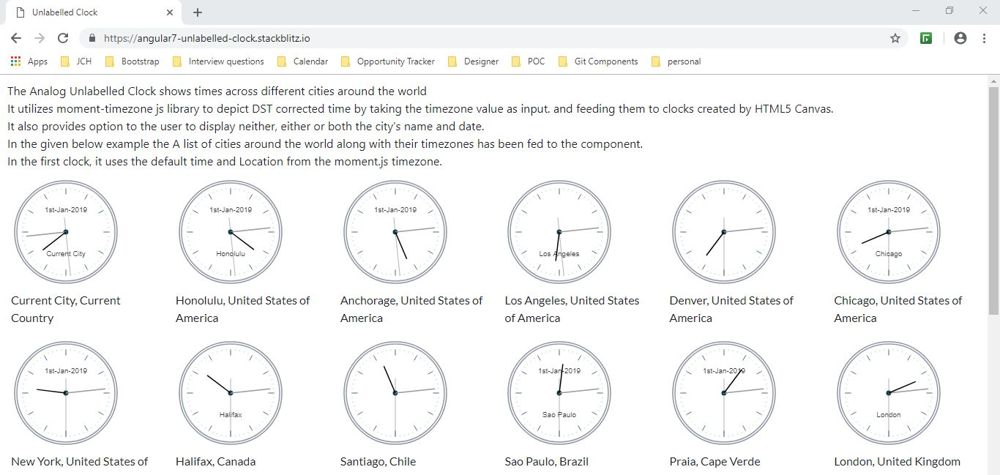
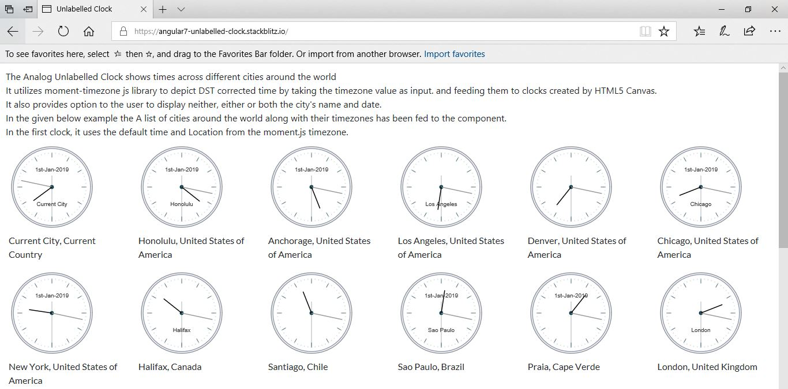
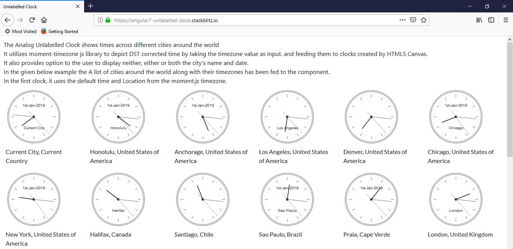
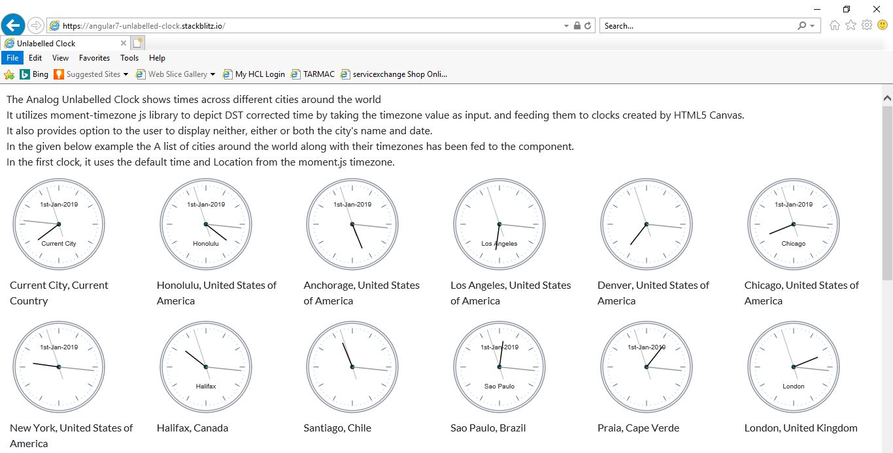
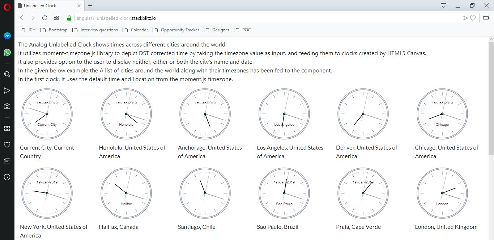

# Unlabelled Clock

Unlablled Clock created using Angular 7, HTML5 Canvas, MomentJSTimezone displays time of cities around the world when provided with their timezone. For list of timezones kindly check- https://en.wikipedia.org/wiki/List_of_tz_database_time_zones 







## Demo

Checkout the demo on StackBlitz - https://angular7-unlabelled-clock.stackblitz.io/

## Adding the component in your project

### Add Component in module
Import
`
import { UnlabelledClockComponent } from './components/unlabelled-clock/unlabelled-clock.component';
`

Declaration
`
declarations: [
     UnlabelledClockComponent
  ]
`

### Add selector in HTML

```
<app-unlabelled-clock [city]="city.name" [timezone]="city.timezone" [displayDate]="city.displayDate" [displayName]="city.displayName"></app-unlabelled-clock>
```
### Selector Properties

Property `city` represents city name which user wants to display in the clock canvas like 'New York', 'Los Angeles'.
<br/>
`timezone` represents the timezone of particular city as per IANA tz database like 'America/New_York', 'America/Los_Angeles'.
If no value is provided, it tries to guess the timezone using `moment.tz.guess()`
<br/>
`displayDate` represents the option whether the user wants to display date in the format Do MMM YYYY like '1st Jan 2019' in the clock canvas. Default Value is false.
<br/>
`displayName` represents the option whether the user wants to display city name like 'New York', 'Los Angeles' in the clock canvas. Default Value is false.

### unlabelled-clock.component.ts
``` typescript
import { Component, OnInit, AfterViewInit, Input} from '@angular/core';
import moment from 'moment-timezone';

@Component({
  selector: 'app-unlabelled-clock',
  templateUrl: './unlabelled-clock.component.html',
  styleUrls: ['./unlabelled-clock.component.css']
})
export class UnlabelledClockComponent implements  OnInit, AfterViewInit {

  @Input() timezone;
  @Input() city;
  @Input() displayName: boolean;
  @Input() displayDate: boolean;
  public interval;
  public canvas: any;
  public ctx: any;
  public date: any;
  public angle: any;
  public secHandLength: any;
  constructor() { }

  ngOnInit() {
      if (!this.timezone) {
          this.timezone = moment.tz.guess();
      }
      if (!this.city) {
          this.city = 'local';
      }
  }

  ngAfterViewInit() {
      this.interval = setInterval(() => {
        this.canvas = <HTMLCanvasElement> document.getElementById('unlabelledClockCanvas-' + this.timezone + '-' + this.city);
        this.ctx = this.canvas.getContext('2d');
        this.date = moment().tz(this.timezone);
        this.secHandLength = 60;
        this.showClock(this.ctx, this.canvas, this.date, this.secHandLength, this.angle);
      }, 1000);
  }
  showClock(ctx: any, canvas: any, date: any, secHandLength: any, angle: any) {

      // CLEAR EVERYTHING ON THE CANVAS. RE-DRAW NEW ELEMENTS EVERY SECOND.
      ctx.clearRect(0, 0, canvas.width, canvas.height);
      this.outerDial1(ctx, canvas, secHandLength);
      this.outerDial2(ctx, canvas, secHandLength);
      this.centerDial(ctx, canvas, date);
      this.markTheHours(ctx, canvas, secHandLength, angle);
      this.markTheSeconds(ctx, canvas, secHandLength, angle);
      this.showSeconds(ctx, canvas, date, secHandLength, angle);
      this.showMinutes(ctx, canvas, date, secHandLength, angle);
      this.showHours(ctx, canvas, date, secHandLength, angle);
  }

  outerDial1(ctx: any, canvas: any, secHandLength: any) {
      ctx.beginPath();
      ctx.arc(canvas.width / 2, canvas.height / 2, secHandLength + 10, 0, Math.PI * 2);
      ctx.strokeStyle = '#92949C';
      ctx.stroke();
  }

  outerDial2(ctx: any, canvas: any, secHandLength: any) {
      ctx.beginPath();
      ctx.arc(canvas.width / 2, canvas.height / 2, secHandLength + 7, 0, Math.PI * 2);
      ctx.strokeStyle = '#929BAC';
      ctx.stroke();
  }

  centerDial(ctx: any, canvas: any, date: any) {
      ctx.beginPath();
      ctx.arc(canvas.width / 2, canvas.height / 2, 2, 0, Math.PI * 2);
      ctx.lineWidth = 3;
      ctx.fillStyle = '#353535';
      ctx.textBaseline = 'middle';
      ctx.textAlign = 'center';
      if (this.displayDate) {
        ctx.fillText(date.format('Do-MMM-YYYY'), (canvas.width / 2), (0.30 * canvas.height));
      }
      if (this.displayName) {
        ctx.fillText(this.city, (canvas.width / 2), (0.70 * canvas.height));
      }
      ctx.strokeStyle = '#0C3D4A';
      ctx.stroke();
  }

  markTheHours(ctx: any, canvas: any, secHandLength: any, angle: any) {
    for (let i = 0; i < 12; i++) {
        angle = (i - 3) * (Math.PI * 2) / 12;       // THE ANGLE TO MARK.
        ctx.lineWidth = 1;            // HAND WIDTH.
        ctx.beginPath();

        const x1 = (canvas.width / 2) + Math.cos(angle) * (secHandLength);
        const y1 = (canvas.height / 2) + Math.sin(angle) * (secHandLength);
        const x2 = (canvas.width / 2) + Math.cos(angle) * (secHandLength - (secHandLength / 7));
        const y2 = (canvas.height / 2) + Math.sin(angle) * (secHandLength - (secHandLength / 7));

        ctx.moveTo(x1, y1);
        ctx.lineTo(x2, y2);

        ctx.strokeStyle = '#466B76';
        ctx.stroke();
    }
  }

  markTheSeconds(ctx: any, canvas: any, secHandLength: any, angle: any) {
      for (let i = 0; i < 60; i++) {
          angle = (i - 3) * (Math.PI * 2) / 60;       // THE ANGLE TO MARK.
          ctx.lineWidth = 1;            // HAND WIDTH.
          ctx.beginPath();

          const x1 = (canvas.width / 2) + Math.cos(angle) * (secHandLength);
          const y1 = (canvas.height / 2) + Math.sin(angle) * (secHandLength);
          const x2 = (canvas.width / 2) + Math.cos(angle) * (secHandLength - (secHandLength / 30));
          const y2 = (canvas.height / 2) + Math.sin(angle) * (secHandLength - (secHandLength / 30));

          ctx.moveTo(x1, y1);
          ctx.lineTo(x2, y2);

          ctx.strokeStyle = '#C4D1D5';
          ctx.stroke();
      }
  }

  showSeconds(ctx: any, canvas: any, date: any, secHandLength: any, angle: any) {
       const sec = date.seconds();
      angle = ((Math.PI * 2) * (sec / 60)) - ((Math.PI * 2) / 4);
      ctx.lineWidth = 0.5;              // HAND WIDTH.

      ctx.beginPath();
      // START FROM CENTER OF THE CLOCK.
      ctx.moveTo(canvas.width / 2, canvas.height / 2);
      // DRAW THE LENGTH.
      ctx.lineTo((canvas.width / 2 + Math.cos(angle) * secHandLength),
          canvas.height / 2 + Math.sin(angle) * secHandLength);

      // DRAW THE TAIL OF THE SECONDS HAND.
      ctx.moveTo(canvas.width / 2, canvas.height / 2);    // START FROM CENTER.
      // DRAW THE LENGTH.
      ctx.lineTo((canvas.width / 2 - Math.cos(angle) * 20),
          canvas.height / 2 - Math.sin(angle) * 20);

      ctx.strokeStyle = '#586A73';        // COLOR OF THE HAND.
      ctx.stroke();
  }

  showMinutes(ctx: any, canvas: any, date: any, secHandLength: any, angle: any) {

      const min = date.minutes();
      angle = ((Math.PI * 2) * (min / 60)) - ((Math.PI * 2) / 4);
      ctx.lineWidth = 1.5;              // HAND WIDTH.

      ctx.beginPath();
      ctx.moveTo(canvas.width / 2, canvas.height / 2);  // START FROM CENTER.
      // DRAW THE LENGTH.
      ctx.lineTo((canvas.width / 2 + Math.cos(angle) * secHandLength / 1.1),
          canvas.height / 2 + Math.sin(angle) * secHandLength / 1.1);

      ctx.strokeStyle = '#999';  // COLOR OF THE HAND.
      ctx.stroke();
  }

  showHours(ctx: any, canvas: any, date: any, secHandLength: any, angle: any) {

      const hour = date.hours();
      const min = date.minutes();
      angle = ((Math.PI * 2) * ((hour * 5 + (min / 60) * 5) / 60)) - ((Math.PI * 2) / 4);
      ctx.lineWidth = 1.5;              // HAND WIDTH.

      ctx.beginPath();
      ctx.moveTo(canvas.width / 2, canvas.height / 2);     // START FROM CENTER.
      // DRAW THE LENGTH.
      ctx.lineTo((canvas.width / 2 + Math.cos(angle) * secHandLength / 1.5),
          canvas.height / 2 + Math.sin(angle) * secHandLength / 1.5);

      ctx.strokeStyle = '#000';   // COLOR OF THE HAND.
      ctx.stroke();
  }
}

```

### unlabelled-clock.component.html

``` html

<canvas id="{{ 'unlabelledClockCanvas-' + timezone + '-' + city}}" width="150" height="150"></canvas>   

```
## Author

parasmani.jain2208@gmail.com

